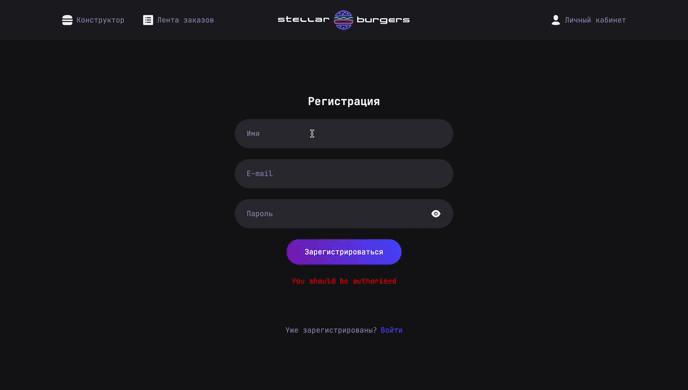

# STELLAR BURGER 🍔🪐
Приложение для создания уникальных бургеров и оформления заказов онлайн. 

Пользователи могут использовать виртуальный конструктор, чтобы собирать свои идеальные бургеры, выбирая из широкого ассортимента межгалактических ингредиентов, соусов и булочек. Также, приложение предлагает возможность отслеживания истории заказов через личный профиль.

**Создайте свой бургер мечты всего в несколько касаний!**

   

[Макет проекта](https://www.figma.com/file/FEeiiGLOsE7ktXbPpBxYoD/Custom-dropdown?type=design&node-id=0%3A1&mode=design&t=eXRJnWC6Xsuw0qR4-1)

## Что было сделано?
1. Настроен роутинг.
2. Написан функционал запросов данных с сервера, используя Redux и глобальный store.
3. Настроена авторизация и созданы защищённые роуты.
4. Написаны unit тесты на Jest:
* тест, проверяющий корректную настройку и работу корневого редьюсера.
* тесты, проверяющие редьюсер слайса burgerConstructorSlice (конструктора бургера).
* тесты, проверяющие редьюсеры остальных слайсов: при вызове экшена Request, Success, Failed.
5. Написаны интеграционные тесты на Cypress.


## Технологии
* HTML, CSS, React, React-Router, TypeScript, React-Redux, Webpack

## Установка и запуск
### Требования
Для установки и запуска проекта, необходим NodeJS v8+.

### Установка зависимостей
Для установки зависимостей, выполните команду:
```
$ npm i
```
### Запуск Development сервера
Чтобы запустить сервер для разработки, выполните команду:
```
npm start
```
## Тестирование
Для запуска тестирования на Jest, выполните команду:
```
npm test
```
Для запуска тестирования на Cypress, выполните команду:
```
npm run cypress:open
```
## Важно:

Для корректной работы запросов к серверу необходимо добавить переменную BURGER_API_URL в окружение. Сама ссылка находится в файле `.env.example`.
